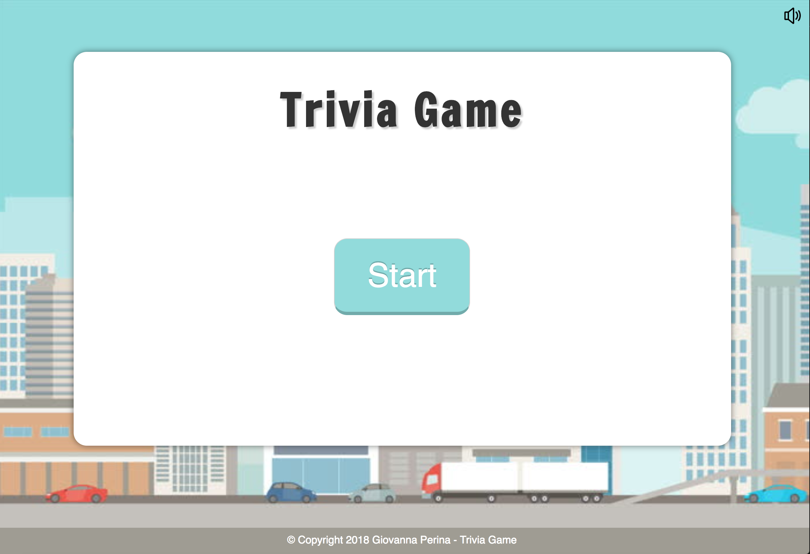
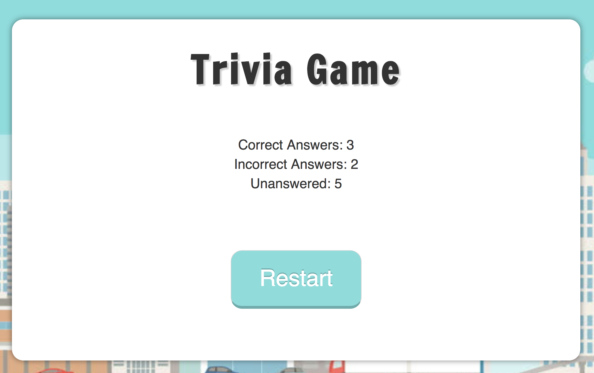

# TriviaGame

The Trivia Game is using JavaScript for the logic and jQuery to manipulate HTML.

### Layout 

---

### Game 
- If the player selects the correct answer, Trivia Game shows a gif congratulating for choosing the right option. Similar for wrong and time-outs.

---

### Time Out 

---

## Results
On the final screen, Trivia Game shows the player the number of correct answers, incorrect answers, and an option to restart the game.

